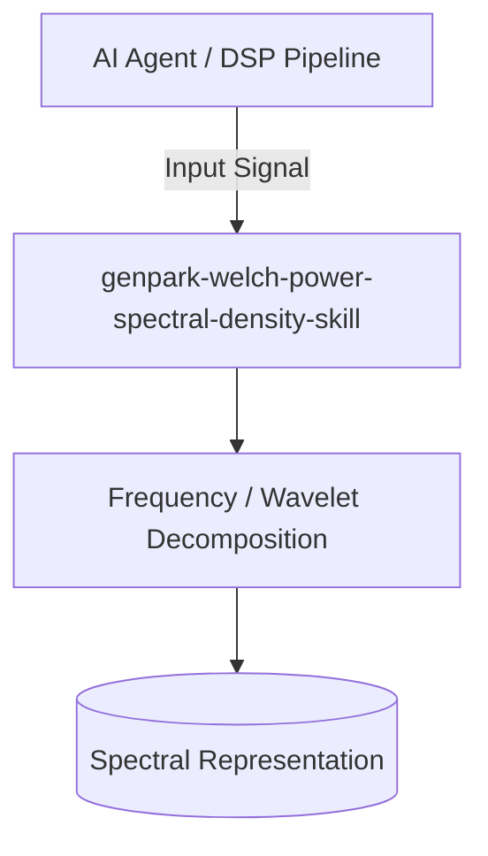

# genpark-welch-power-spectral-density-skill

[](https://github.com/alphaparkinc/genpark-welch-power-spectral-density-skill/actions)
[](https://opensource.org/licenses/MIT)
[](https://www.python.org/downloads/)

> Welch's periodogram method for Power Spectral Density (PSD) estimation using Hann-windowed overlapping signal segmentation.

## Architecture



## Features
- Pure standard library Python implementation with strictly zero pip dependencies.
- Mathematically rigorous implementations of Fourier, Wavelet, Cosine, and Hilbert transforms.
- Native Model Context Protocol (MCP) server support for AI agent signal analysis.

## Installation

```bash
git clone https://github.com/alphaparkinc/genpark-welch-power-spectral-density-skill.git
cd genpark-welch-power-spectral-density-skill
```

## Quickstart

```bash
python example_usage.py
```
